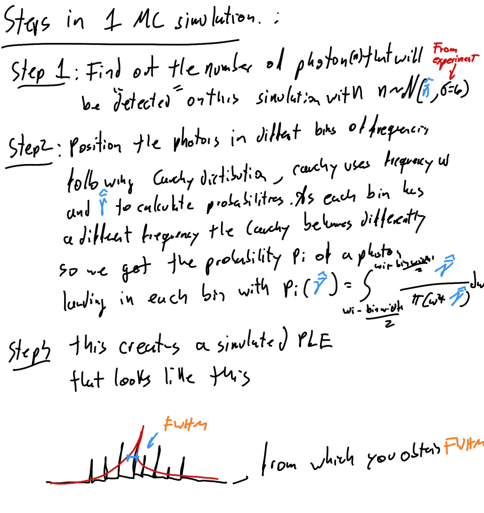
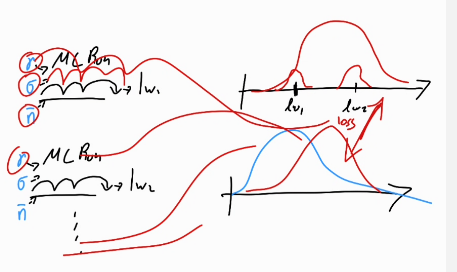

you # Project Journal

*Development of the project step by step, from ideas, tasks and conclusions*

---
# 13.05.2026

## Meeting Dr. Pieplow

Had the first meeting with Dr. Pieplow. He mentioned that I am free to try what I feel makes sense, as this is not a master thesis I can take my time if I manage to get something out of the project, then we all win.

He mentioned some topics that I can start to get familiar with. 

- 2 Level Quantum system with stochastic noise "Spectral shaped based on noise process"
- Description of PLE NV (how does the measurement work in detail)
- Big Goal: Parameter Estimation specifically line with in low signal regime
- Fischer Infomation
- Parameter uncertainty.

We agreed on having weekly meetings.


## Idea: Hyrid Model approach
I am curious to explore the different way you can model this process and if a hybrid approach of an enhanced physic informed model could be apply to achieve the desired goal. **Never the less** first understanding the current status in detail seems the most sensitive first step.
 
# 15.05.2026

## OpenClaw Configuration
Created and OpenClaw Agent called Pukky running in separate computer. I tested if it could acces the main branch and decided to create a specific github account for it and joined it as collaborator.

gmail account: pukky.struki@gmail.com
github account: pukky-struki


Also Added Deepseek Extension to VS Code, now my agent in VS Code and openclaw use the same model.

## Worked on the structure of the project.
Did some research on different project structures for projects based on research and coding.

We decided on a lean **research-first** structure:

```
qm-ml/
├── README.md          # Dashboard — overview, tasks, checklist
├── JOURNAL.md         # Running log — ideas, decisions, notes
├── docs/papers/       # PDFs of papers we read
├── notebooks/         # Jupyter notebooks for exploration & prototyping
├── requirements.txt
└── .gitignore
```

The idea: keep it simple during the research phase. When we move to writing actual library code, we'll expand with:

```
src/          # Production code (quantum/, models/, utils/)
tests/        # Unit tests
data/         # Datasets (gitignored)
``` 


# 22.05.2026

## Understanding paper

I started reading the papaer in detail, I am getting a much better idea of the whole problem and the approach to solve it.

Here is a summary of the Monte Carlo Method in General


Here is a Summary of one Monte Carlo Simulation



## Idea: Optimizing $\sigma$
Try optimizing for more parameters, I understand that in the experiment they do a grid search for $\gamma$ and $\bar{n}$ (as they are only 2) but in the process of understanding the montecarlo simulation I though we can also try to optimize other parameters that are fixed like $\sigma = 6$ or $\lambda = 2$, for more parameters grid search might be better substituted by hyperopt or similar. I will first have a deeper understanding on each step of the MCM to see if this makes sense

## Idea: Hybrid approach
I still believe that we could create a hybbrid model where we exploit our knowledge of the physics behind the process. Maybe creating a different type of MonteCarlo simulation, maybe creating something using the real data and optimizing few parameters form the hybrid model.

## TODO

- [X] I have a much better understanding but would like to go deeper on the choice of a cauchy distribution and what physical meaning does $\gamma$ has in the whole story and in realtion to the Cauchy distribution.


## Notebook

I created a notebook `notebooks/Hyperopt-n-sigma-gamma.ipynb` where I command Pukky to test my idea of using hyper opt. This is more a test for pukkies capabilites and to have a start.

## Questions for Gregor

1. [X] Can I get access to the real data

2. [X] Why sigma 6? Is there more parameters that we could optimize?
3. [X] Is the idea in general sinfull?
4. [ ] What exactly was the experimental Voigt fit model? The paper (Eq. S1) shows a bare Voigt fit with lmfit least-squares on a binned spectrum, with no background/uniform term. In my differentiable version I added a `(1−w)·uniform` background term to the fit for MLE stability (see Finding 3). By the MCM logic (reproduce the estimator's bias → use the same estimator the experiment used), I should imitate the experimental fit as closely as possible — so it matters whether their fit was (a) truly bare Voigt, (b) Voigt + a constant baseline offset (lmfit `ConstantModel`), or (c) something else. Which was it? This determines whether I should keep, drop, or change the uniform term to faithfully reproduce the real FWHM distribution. Also: what's the **scan step / bin width** (2.2 MHz?), and is the FWHM distribution sensitive to it? (My fit is unbinned/continuous — see Finding 2 update.)


# 23.05.2026

## Optimization Algorithm
My Agent completed the notebook `notebooks/Hyperopt-n-sigma-gamma.ipynb` and I did the first test and it seems to work, never the less, I want to debugg it line by line to be sure of its functionality.

## Cauchy Interpretation
I finished understanting that the Cauchy distribution represent the absortion probabilty (which comes from the Fourier of the decay function). This made me realize that the whole physical process of absortion and emitions of photons is summarized in this curve. This gave rise to the next idea.

## Idea: Analyzing complexer models

Here are there models that go a step deeper and model the interactions to a more detailed level. Can we shift the parameter optimization to that model? This would be the beginning of the hybrid model approach.

Following is a first list of possible ideas obtained from a simple prompt (not analized in detail yet). This is a good start point to think of other strategies, by understanding other models I can start getting an idea of how to build a hybrid model. What I understand now, is that in the paper from Dr. Pieplow, a simplified 2-level system was used and therefore all that we want to find is the FWHM, for this we used MCM. My idea would be to create a model from scratch based on one of these complexer models, identify important parameters to optimize and use the existing real data to optimize them using PyTorch. I am aware of the fact that the real data had the issue of low signal-noise ration, this could make the simple suppervised learning approach difficult. So maybe some kind of MC must be included aswell, because now that i think about it, how would my loss function for the optimization look like? 


## Complexer Models

This models came from a simple prompt. There has been no analysis yet, this is simply a starting point.

>Prompt: can you research if there are more complex models that model this relaitonship. Right now we are modeling the whole absorbtion and emision simply with the absorbtion probaility, is ther a mathematical model that goes a bit deeper?

## 1. Weisskopf-Wigner (your paper's model)

**What it models:** Absorption + emission collapsed into a single Lorentzian lineshape.

**Key approximations:**
- Weak excitation (NV mostly in ground state)
- Zero temperature (no phonon absorption)
- No distinction between absorption and emission steps
- No quantum correlations between emitted photons

**Equation:**
$$ I_{\text{PL}}(\omega) \propto \frac{\gamma}{\pi[(\omega-\omega_0)^2 + \gamma^2]}, \quad \gamma = \frac{1}{4\pi\tau} $$

**When valid:** Weak excitation, low temperature, no cavity, only need emission probability (not photon statistics).

---

## 2. Master equation (Jaynes–Cummings + Lindblad)

**What it adds:** Explicit time evolution of the NV + laser field + environment. Treats absorption and emission as separate quantum jumps.

**Model details:**
The NV center is treated as a vibronic system with ground state sublevels $|g_i\rangle$, excited state $|e\rangle$, and metastable singlet state $^1A$. The Hamiltonian includes:

$$ \hat{H}_{\text{JC}} = \sum_i \omega_{g_i} |g_i\rangle\langle g_i| + \omega_e |e\rangle\langle e| + \omega_C \hat{a}^\dagger \hat{a} + \frac{1}{2}\sum_i \left( \Omega_i \hat{a}^\dagger |g_i\rangle\langle e| + \text{H.c.} \right) $$

The Lindblad master equation adds dissipation:

$$ \frac{d\rho}{dt} = -i[\hat{H},\rho] + \sum_j \gamma_{g_j e} \mathcal{L}[\sigma_{g_j e},\rho] + \kappa \mathcal{L}[\hat{a},\rho] + \gamma_{\text{deph}} \mathcal{L}[\sigma_{ee},\rho] $$

where $\mathcal{L}[\hat{O},\rho] = \hat{O}\rho\hat{O}^\dagger - \frac{1}{2}(\hat{O}^\dagger\hat{O}\rho + \rho\hat{O}^\dagger\hat{O})$ are Lindblad terms for spontaneous emission, cavity loss, and dephasing.

**Key physics captured:**
- **Purcell enhancement:** $\gamma_{\text{eff}} = \gamma_0(1 + F_p)$ with $F_p = \frac{3Q(\lambda/n)^3}{4\pi^2V}$
- **Power broadening:** $\Delta\nu = \Delta\nu_0 \sqrt{1 + I/I_{\text{sat}}}$
- **Mollow triplet:** at very high power, single Lorentzian splits into three peaks

**When to use:** Cavity-coupled emitters, high excitation power, when photon statistics matter.

---

## 3. Huang-Rhys (electron‑phonon coupling)

**What it adds:** Explicitly models how the NV's electronic transition couples to diamond lattice vibrations (phonons). This produces the phonon sideband (PSB) seen in NV spectra.

**Huang-Rhys model:**
Total luminescence lineshape:

$$ I(\omega) = I_0 \underbrace{e^{-S}\delta(\omega - \omega_0)}_{\text{ZPL}} + \underbrace{I_0 e^{-S} \sum_{n\ge1} \frac{S^n}{n!} \rho_n(\omega - \omega_0)}_{\text{Phonon sideband}} $$

where:
- $S$ = Huang-Rhys factor (electron-phonon coupling strength)
- For NV⁻, $S \approx 3.5$
- Debye-Waller factor (ZPL fraction) $DW = e^{-S} \approx 0.03$ → only ~3% of emission is in the ZPL

**When to use:** Understanding the low signal in PLE (most emitted light is in the PSB, not the ZPL).

---

## 4. Rapid dispersal (time‑dependent lineshape)

**What it adds:** The Lorentzian lineshape assumes detection after infinite time. At finite times after emission, the lineshape is not Lorentzian.

**Key idea:**
Immediately after emission, the photon wavepacket hasn't fully separated from the emitter. Measuring at early times gives a different spectral distribution than the asymptotic Lorentzian.

**When to use:** Ultrafast spectroscopy (picosecond time resolution), single-photon sources with sub‑ns timing.

---

## 5. Charge‑state switching (NV⁻ ↔ NV⁰)

**What it adds:** Under resonant excitation at 637 nm, NV⁻ can ionize to NV⁰ (dark under red excitation) and then recombine back. This causes blinking.

**Rate equation model:**

$$ \frac{dP_-}{dt} = -k_{\text{ion}} P_- + k_{\text{rec}} P_0 $$
$$ \frac{dP_0}{dt} = +k_{\text{ion}} P_- - k_{\text{rec}} P_0 $$

where $k_{\text{ion}}$ and $k_{\text{rec}}$ are power‑dependent. For NV⁻ in diamond, $k_{\text{ion}}$ is a two‑photon process (quadratic in power), $k_{\text{rec}}$ can be linear in power if donor impurities (e.g., phosphorus) provide electrons.

**When to use:** When you observe blinking or want to model the fraction of time the NV is in the bright (NV⁻) state.


## TODO

- ~~[ ] Debugg Hyperopt-n-sigma-gamma.ipynb to be sure that the AI generated code works as expected (first test showed no errors but deeper analysis is needed)~~

- [ ] Read the complexer models more in detail

- [X] Rethink TODO noting, if I should migrate the todos to the Readme file or just keep everything here


# 25.05.2026

## Idea: Monte Carlo with PyTorch and loss function

The current approach generated several MC simulations and using grid search tries to find the best original parameters $\bar{n}$ and $\gamma$. What if instead of doing Grid Search, we could us PyTorch to have these parameters as model parameters that get optimized with the loss function calculated through the $\chi^2$ comparison of many MC simulations. So we dont optimize in one run, we do a batch of for example 2000 MC simulations and optimize. I will have to refresh loss function and optimization with stochasitc procesees. 

## TODO:

- [x] Refresh how loss-optimization of stochastic procesees work for PyTorch MC idea.

## MC-PyT solution 1: Reparametrization
Differentiable Parameter Optimization for Simulation Pipelines

### Problem
We need to optimize two parameters (e.g., µ and σ of a normal distribution) whose samples feed into a complex simulation. The simulation outputs a histogram that we compare to a target distribution using a chi‑squared test. Grid search over discrete parameter values is inefficient.

### Key Idea
Make the entire pipeline **differentiable** so we can use gradient descent instead of grid search.

### How It Works (One Training Step)

1. **Fix random noise** – Draw ε₁,…,εₙ from N(0,1) once and keep them fixed.
2. **Reparameterized samples** – For current µ, σ:  
   `xᵢ = µ + σ·εᵢ`  (differentiable w.r.t. µ, σ)
3. **Run the complex process** – Compute `yᵢ = f(xᵢ)` for each sample.  
   (We assume `f` is differentiable or replaced by a smooth surrogate.)
4. **Smooth density estimation** – Replace the hard histogram with a **Kernel Density Estimate (KDE)**:
   `p̂(y) = average over i of K(y - yᵢ)`
5. **Differentiable loss** – Replace the chi‑squared test with a smooth divergence between `p̂` and the target distribution (e.g., MMD, KL, or Sinkhorn).
6. **Gradient descent** – Compute `∂Loss/∂µ` and `∂Loss/∂σ` via automatic differentiation.  
   Update: `µ ← µ - α·∂Loss/∂µ`, `σ ← σ - α·∂Loss/∂σ`.

### Why This Works
- The reparameterization trick turns random sampling into a deterministic, differentiable function.
- KDE replaces non‑differentiable binning with a smooth density.
- Smooth divergences replace the discrete chi‑squared statistic.

### What We Gain
- Continuous, gradient‑based optimization (no grid).
- Scales well to many parameters.
- Smooth loss landscape.

### Practical Notes
- Use a fixed set of noise samples εᵢ throughout training for low‑variance gradients.
- Typical sample size: n = 100–1000 per step.
- If the complex process is not differentiable, train a neural network surrogate.

### Summary
By reparameterizing the random sampling, smoothing the density estimate, and using a differentiable divergence, we transform a discrete simulation‑based calibration problem into a continuous optimization problem solvable with gradient descent. Note, we would generate many samples to obtain many linewithds to obtain the KDE that substitutes the $\chi^2$ test from hitogram and do gradient descent through all the sample. So each comparison would be a batch, where many MC simulations would have been created.


## TODO:
- [ ] Solution proposed was for a simple example, check how to apply it to our montecarlo simulation


# 27.05.2026

## Meeting Summary

I had a meeting with Gregor and Carla, which was very fruitfull. I explained my understanding of the MC simulation, which we called a run in the meeting to avoid confusion. My understanding was correct. I asked about the fact that $\sigma, \hat{n}, \lambda, \gamma$ could be optimized, he said that this is a possibility and that at the moment grid search of $\sigma$ and $\hat{n}$ was the easiest solution.

I proposed the Hyperopt idea, he mentioned that this is something that could be done, but that it didn't seem to be something very new compared to what we already have, so even as interesting as it could be this approach should not be the focus of further development. 

On the other hand, the [Monte Carlo PyTorch idea](#idea-monte-carlo-with-pytorch-and-loss-function), (converting the Montecarlo Simulation to a backpropagatable problem using maybe PyTorch) was more interesing for him as it actually exploits an ML strategy an proposed a newer approach (which appears to be relevant). For this reason my next steps will be to find out how to achieve this. I could inspire myself in the project Denmark-Covid Project. He mentioned that for access to the data he would have to ask Laura (?) and hinted that the data might be have already be used for the last paper (or so I understood). We discussed for a while on ideas on how the backpropagatable idea (might need a better name) could work and he mentioned some comment were he thinks it might fail. I believe that already from the intial formulation it would be clear if this is achievable the [Reparametrization solution](#mc-pyt-solution-1-reparametrization) is only a first idea, more approaches could be found. 

Here a small sketch I used in the meeting for explanation of the idea:




Parameter uncertainty was a big topic, he mentioned that that is even more interesting that the optimal values itself, so after seeing if the problem is backpro... differentiable (from now on). After seing if I can create a differentiable MC simulation I should see how to find the parameter uncertainty (which I believe should be so complicated in the context of ML)

Fischer Information came back again, so I should look into what that exactly means.

I also agreed on sharing this repo with them, so I will be carefull on what I write about them (just a joke in case you are here.)

## TODO

- [ ] Look for different approaches to make a montecarlo simulation backpropagatable, so that we can optimize the parameters using the histogram (or similar) comparison as loss function. This will evolve in more Todos.

- [ ] Understan Fischer Information in the parameter uncertainty context

---

# 12.06.2026

## Differentiable Sampling Ideas

New ideas for making the first part of the problem (random sampling of electrons) differentiable.

### STE + Finite-Difference Optimisation for Discrete Simulation Counts

Optimising μ, σ of a normal distribution when the sampled value determines a discrete simulation count (n = round(x)).

- Use the **reparameterisation trick**: x = μ + σε, ε ∼ 𝒩(0,1).
- **Rounding is non‑differentiable** → apply the **Straight‑Through Estimator (STE)**: forward pass uses real rounding; backward pass pretends ∂n/∂x = 1.
- The **black‑box loss L(n)** has no analytical gradient → estimate ∂L/∂n via finite differences, e.g. central difference (L(n+1) − L(n−1))/2.
- **Gradients for the parameters** then become: ∇μ = gₙ, ∇σ = gₙ·ε, where gₙ is the finite‑difference estimate.
- Update μ, σ with gradient descent. The method is **biased** (due to the STE) but **low‑variance** and simple to implement, often working well when the loss varies smoothly with n.

---

# 19.06.2026

## Meeting with Gregor & Clara

Had a meeting with Gregor and Clara today. I walked them through the differentiable MC idea in detail — the full pipeline I've been building in the notebooks.

### What I showed them

The conceptual split into two challenges:
1. **Making the sampling differentiable** (ch2) — reparameterization trick + STE + finite-difference surrogate gradients for the discrete photon count sampling
2. **Differentiating through the fit** (ch3) — implicit differentiation through the Voigt/Lorentzian fit, so we can backprop through the FWHM extraction without unrolling the optimizer

I demonstrated that ch3 is already working: a full optimization loop where we start with a guess for the true linewidth γ_true and gradient-descend through the fit to recover the target. The parameters converge and gamma_fit reaches the expected value.

### Their response

Both understood the approach. Gregor is on board — I'm supposed to implement this. The overall direction was validated. The code and notebooks are in good shape to move forward.

### Key open question: histogram → KDE conversion

The interesting conceptual challenge that came up:

In the original paper, the comparison is **histogram vs histogram** (simulated linewidth distribution vs experimental linewidth distribution) via χ². In the differentiable version, we want to compare **KDE vs ?** — but the real experimental data is a histogram of fitted linewidths. How do we convert it to something smooth and differentiable?

Options discussed:
- Fit a KDE to the experimental histogram and compare KDE-to-KDE (divergence like KL, MMD, or Sinkhorn)
- Use the experimental histogram to parameterize a smooth density (e.g. a Gaussian mixture) and compare via a differentiable divergence
- Keep the histogram on the experimental side but use a smooth surrogate for the χ² loss (e.g. a differentiable binning approximation)

**Another idea: Integrated Squared Error (L2) on Bin Counts** — instead of the χ² statistic, use the sum of squared differences between simulated and experimental bin counts directly. This is simpler, avoids the χ² weighting (which can blow up for low-count bins), and is differentiable as long as the bin counts come from a differentiable density. The L2 loss gives a smooth landscape and the gradient is straightforward. We'll try this when we get the data.

Gregor mentioned the data could be given to me — waiting on that. This needs more thought and prototyping.

### Revised TODO

- [ ] Prototype histogram → smooth density conversion for real data
- [ ] Compare KDE-to-KDE divergence vs smooth χ² surrogate
- [ ] Port ch2 and ch3 into a unified differentiable MC pipeline
- [ ] Test end-to-end on dummy data (simulate "real" data, then recover parameters)
- [ ] Understand Fisher Information for parameter uncertainty in the ML context

---

# 19.06.2026 (later)

## Pipeline Complete — Moving to Differentiation

Built the entire forward pipeline in `notebooks/differentiable-mc.ipynb`:

| Function | Purpose |
|----------|---------|
| `MCParams` | Container for (γ, n̄, σ, λ) |
| `sample_n` | Reparameterized N ~ N(n̄, σ) |
| `sample_cauchy` | n frequencies from Cauchy(γ) |
| `sample_background` | Uniform background ~ Poisson(λ) |
| `sample_photons` | Concatenates signal + background |
| `fit_pseudo_voigt` | MLE via L-BFGS → FWHM per run |
| `full_run` | Params in → one FWHM out |
| `simulate` | N runs → FWHM distribution |
| `kde` | Smooth differentiable density |
| `kde_to_bin_counts` | FWHMs → smooth bin counts via erf |
| `l2_loss` | L2 between two histograms |

Full pipeline tested: 200 runs, no inf/nan, loss landscape works (wrong params → higher loss, same params → lower loss).

### Timing
Ran timing tests: 1 run ≈ 0.034s, 100 runs ≈ 3.6s, 2000 runs ≈ 72s (1.2 min). L-BFGS is the bottleneck but it's manageable — a 200-step optimization loop would take roughly 4-8 hours.

### Organization discussion
- Chose to keep functions in the notebook for now (no utils.py) — refactor when pipeline stabilizes
- Restructured code: separated `sample_n`, `sample_cauchy`, `sample_background`, composed into `sample_photons`
- MCParams dataclass keeps parameters grouped

### Loss function discussion
- Built `kde_to_bin_counts` (erf-based smooth binning) + `l2_loss`
- Discussed whether KDE → hist → loss is redundant
  - Option A: soft binning (direct erf) — this is what we do, just named confusingly
  - Option B: compare KDE-to-KDE directly — not possible without raw experimental data
  - Keeping current naming since it's easier to understand

### Optimization strategy discussion

**The core problem:** We need to optimize (γ, n̄) simultaneously but they have different gradient properties:
- γ flows through a continuous chain (Cauchy → fit → FWHM → loss) — potentially differentiable
- n̄ hits `round()` — discrete step, needs finite-difference

**Ideas discussed:**

1. **Optimize γ first, sweep n̄ later** — Phase 1: gradient descent on γ with n̄ fixed. Phase 2: sweep n̄ candidate values. Problem: assumes γ and n̄ are independent, which they're not (paper Fig 3b shows coupling).

2. **Alternating — my idea (2 sims/step)** — Run sim at (γ, n̄) for γ gradient. Run sim at (γ, n̄+1) for one-sided finite-diff on n̄. Update both each step. 2 sims/step. Concern: γ gradient is evaluated at the *wrong* n̄, one-sided fd is biased.

3. **Alternating with averaging (2 sims/step)** — Run sim at (γ, n̄+1) and (γ, n̄-1). Average the γ gradients from both (batch size 2). Use both losses for central fd on n̄. 2 sims/step. Concern: batch size 2 for γ buys nothing since gradients are deterministic with fixed noise.

4. **Central diff (3 sims/step)** — Run at (γ, n̄), (γ, n̄+1), (γ, n̄-1). Use middle for γ gradient (correct n̄). Use L+ and L- for unbiased central fd on n̄. 3 sims/step. 50% more expensive but cleaner.

5. **All finite-difference** — Probe every parameter via fd, works with existing code, scales to 3+ params at cost (N+1) sims/step.

**Key insight:** The real bottleneck is L-BFGS (2000 fits per simulation), not the forward pass itself. Time test showed 1 sim ≈ 1.2 min, so any strategy with 2-3 sims/step requires 4-8h for 200 steps — doable but not real-time.

**Next step:** Make γ differentiable first (implicit diff through fit), then decide on the optimization loop structure.

### Updated TODO

- [x] Sampling (continuous photons)
- [x] Voigt fitting (MLE via L-BFGS)
- [x] Collapse (simulate 2000 runs → FWHM distribution)
- [x] KDE
- [x] Loss function (kde_to_bin_counts + L2)
- [ ] **Make the pipeline differentiable** — implicit diff through fit + reparameterized sampling
- [ ] **Decide optimization strategy** — from the ideas above
- [ ] Test end-to-end optimization on dummy data
- [x] Get real data from Gregor
- [ ] Understand Fisher Information for parameter uncertainty

---
# 27.06.2026

## Real data from Gregor — received & understood

Gregor sent the experimental PLE line-width data, now in `data/raw_data/`. Went through it and figured out the organization (full write-up in [data/raw_data/data_explanation.md](../data/raw_data/data_explanation.md)):

- Two sessions by red-laser power: `fwhm_1nW_240221/` (1 nW) and `fwhm_3nW_210221/` (3 nW), 7 files each sweeping the transmission setting `Trans05 … Trans100`.
- Each file is a 2-column table, 3200 rows = 3200 fit attempts. **Column 1 = line width (FWHM), column 2 = fit error (1σ uncertainty on the FWHM, same units as col 1).** Failed fits = `nan nan` (confirmed by Gregor via email).
- Valid-row count grows with transmission (~160 → ~2500) → effective SNR knob. Median FWHM grows with power → power broadening. Huge col-2 values pair with near-zero FWHM = degenerate fits; `err/fwhm` is the natural quality cut.
- Open question: absolute unit of the line width isn't in the files (notebook currently works in MHz) — to confirm with Gregor later.

So the histogram of valid column-1 values is the experimental FWHM distribution our MC pipeline should reproduce.

## Idea: use the fit error as a weight in the loss (future)

Right now the L2 loss treats every valid FWHM equally. But we also have the per-fit uncertainty (column 2). Future idea: turn the loss into a **weighted** loss using the fit error — down-weight high-uncertainty fits (e.g. weight ∝ 1/σ² or some function of `err/fwhm`) so noisy, low-SNR points contribute less to the bin counts / loss. This should make the experimental FWHM distribution we match against more robust, especially at low transmission where many fits are poor. Revisit once the differentiable pipeline is working.

## Realization: the data are samples, not histograms — switched loss to MMD²

While doing EDA (`notebooks/eda.ipynb`) it clicked that each file is **a list of individual FWHM values** (one per fit attempt), *not* a pre-binned histogram as I'd assumed. Great news: both sides of the loss are now just **sets of samples** — simulated FWHMs (from `simulate()`, parameter-dependent) and real FWHMs (fixed). We no longer have to bin anything or work around histogram comparison (`kde_to_bin_counts` + L2 was only needed to match a binned target).

So we can compare the two distributions directly. Replaced the loss step of `notebooks/differentiable-mc.ipynb` with the **biased MMD²** estimator (Gaussian kernel, median-heuristic bandwidth). Also removed the now-unused KDE step (the old binning workaround) and improved the docstrings throughout, so the pipeline is now Steps 1–6 with MMD² as the final loss step:
- differentiable in the simulated samples → gradients flow back to the params,
- handles unequal sample sizes (m ≠ n) naturally,
- no bins, no grid, no bandwidth-for-binning headache.

Quick sanity test passed: wrong params → MMD² ≈ 0.088, matching params → ≈ 0.003 (much lower).

Note for later: FWHM spans orders of magnitude, so we'll likely apply the loss in `log` space so the single kernel scale is meaningful across the range. Alternatives considered (1-D Wasserstein, Cramér/energy distance, KDE-to-KDE L2) — kept MMD² as the primary, can cross-check against these.

---
# 28.06.2026

## Differentiable pipeline in γ — working end-to-end

Made `gamma` differentiable through the whole pipeline in `notebooks/differentiable-mc.ipynb`, so `loss = mmd2_biased(log10(sim), log10(real)); loss.backward()` produces a correct `gamma.grad` and gradient descent recovers γ. Scope this round: **γ only** (nbar held fixed); inner fit **switched to a Lorentzian** (the matched model). Built and validated as a script first, then ported into the notebook (now Steps 1–8).

**What changed and why:**

1. **Reparameterized sampling.** Per run we fix the randomness as quantiles `u` (+ background `b`, count `N`); the signal detunings `γ·tan(π(u−0.5))` are then a differentiable function of γ.

2. **Truncation instead of clip-to-edge — fixes a latent bug.** The original `np.clip(..., FREQ_MIN, FREQ_MAX)` piled ~17% of the Cauchy mass as spikes at ±75. With those spikes the fitted FWHM was **non-monotonic in γ** (rose then collapsed; γ=30 → median 0.84, mean inf) → γ not recoverable. Switched to **truncation** (out-of-window photons aren't detected) + a **truncation-aware Lorentzian+uniform MLE** (Lorentzian renormalized over the window). This is the correctly-specified estimator: clean recovery on synthetic data (γ=20 → fit 20.07) and median FWHM now **monotonic** in γ.

3. **Inner fit: pseudo-Voigt → Lorentzian + uniform background.** The signal is pure Cauchy, so a Lorentzian is the matched model; `FWHM = 2·γ_fit` exactly, and the 3-param Hessian (center, log_gamma, logit_w) is well-conditioned — important for stable implicit-diff gradients (the 4-param pseudo-Voigt Hessian is ill-conditioned near η saturation).

4. **Differentiating through the fit — implicit function theorem, not unrolling.** Wrapped one run as a `torch.autograd.Function`: forward runs the (detached) L-BFGS fit to find θ*; backward returns `dFWHM/dγ = −(∂FWHM/∂θ)·H_θθ⁻¹·H_θγ` (γ enters the inner NLL only through the data). Hessian blocks via `torch.func`; scale-aware Tikhonov reg + condition/PD guards zero out the rare bad run instead of emitting garbage. Runs on float64.

**Validation (the gates):**
- **Per-run gradient vs central finite difference:** median relative error **0.12%** (90th pct ~1%); large errors only where the true gradient ≈ 0 (degenerate fits).
- **Gradient sign:** points toward γ_true from both sides, ≈ 0 at the truth.
- **End-to-end recovery:** from a wrong start γ=10, recovered **γ = 20.5 ± 0.15** (true 20.0); loss dropped 0.59 → ~0.001 (the same-params noise floor). Slight overshoot above 20 from lr=0.5 + a small (400-run) noisy target — tightens with a bigger target / lower lr.

**Cost:** ~4 s/step at 200 runs (L-BFGS per run dominates). Use a few hundred runs during optimization; full 2000 only for final eval. A `vmap`ed batched Gauss-Newton inner fit is the obvious future speedup.

**Next:** make `nbar` differentiable via the finite-difference surrogate (the photon count is discrete) and run joint (γ, nbar) recovery; then point the loss at the real experimental FWHM data.

## Line-by-line review of the differentiable pipeline

After getting the forward pass working, I handed the code to pukky to make it differentiable **with respect to γ only** (nbar comes later). It claims it managed to do that, so I'm now going through the code line by line to check whether what was done actually sounds correct. I'll log the important findings here as I go.

### Finding 1 — the reparameterization trick for the Cauchy signal

The signal detunings are drawn with `signal_detunings(gamma, u) = gamma * tan(π·(u − 0.5))`, where `u` is a frozen uniform draw. This is the reparameterization trick built on the **probability integral transform** for a Cauchy. Working it out from scratch to confirm it's correct:

**1. The Cauchy distribution.** A photon's detuning from line center follows a Lorentzian = Cauchy with location 0 and scale γ. Its density is

```
            1        gamma
p(x) =  ----- · ---------------          x in (-inf, inf)
           pi      x^2 + gamma^2
```

γ is the half-width at half-maximum: `p(±gamma) = p(0)/2`. The tails decay only like `1/x^2` (heavy tails — this is why we later truncate to the detection window).

**2. The CDF.** Integrating the density gives a closed form:

```
            1     1                 x
F(x)  =   --- + ---- · arctan( ------- )
            2     pi             gamma
```

`F` rises smoothly and monotonically from 0 (x = -inf) to 1 (x = +inf); `F(0) = 1/2`.

**3. The inverse CDF (quantile function).** Solve `u = F(x)` for x:

```
u - 0.5            = (1/pi) · arctan(x / gamma)
pi · (u - 0.5)     = arctan(x / gamma)
tan(pi·(u - 0.5))  = x / gamma
x                  = gamma · tan(pi · (u - 0.5))         = F^{-1}(u)
```

**4. Probability integral transform (why this samples a Cauchy).** The PIT says: if a random variable X has continuous CDF F, then U = F(X) is Uniform(0,1); and conversely, if U ~ Uniform(0,1) then X = F^{-1}(U) has CDF F. So pushing a uniform `u` through the inverse CDF above produces exactly a Cauchy(0, γ) sample. That's the line of code.

**Why this is the *reparameterization* trick (the point for differentiability):** all the randomness lives in `u`, which is drawn once and frozen. γ enters only as a deterministic, smooth multiplier — there's no randomness sitting between γ and the output. So the derivative is exact and well-defined:

```
  d x
------- = tan(pi · (u - 0.5))
d gamma
```

Holding `u` fixed, the photon position is a differentiable function of γ. This is what makes γ recoverable by gradient descent (vs. the old entangled `np.random.standard_cauchy() * gamma`, where the draw and γ are tangled and no clean derivative exists). Sanity checks on the formula: `u = 0.5 → x = 0` (center); `u = 0.25, 0.75 → x = ∓gamma, ±gamma` (the quartiles sit at ±γ, consistent with γ = HWHM); `u → 0 or 1 → x → ∓inf` (the heavy tails). Conclusion: **this part is correct.**

### Finding 2 — continuous representation vs. the experiment's binning

A modeling-choice note to track. In the **real PLE experiment** the spectrum is built by **binning** photon counts into a histogram and fitting a (Voigt) line shape to that histogram — binning is essentially a technological/measurement constraint. In **our simulation** we skip binning entirely: we keep the **continuous photon frequencies** and fit the line shape (Lorentzian MLE) directly to the unbinned points.

We're deliberately keeping the continuous version because it's cleaner and more efficient (no binning information loss / bin-edge artifacts) and, importantly, it's what makes the implicit-diff gradient tractable. The justification for why this is acceptable: **the only thing we ever compare against the experiment is the distribution of FWHMs** — binning is just the experiment's machinery for turning photons into one FWHM per run, not a physical feature of the sample.

**Update — binning is more than "machinery."** A PLE scan *steps the laser* (supplemental: "2.2 MHz/step"), so the instrument never observes an exact detuning — only which step a photon was counted at. Binning is therefore a **measurement constraint** (the scan's frequency resolution), not a free analysis choice, and our continuous `signal_detunings` actually gives the fit *more* frequency info than the apparatus can produce. So the continuous representation is a **tractability approximation**, not strictly more faithful. Likely harmless when many bins span the line (~10-20 at 20-40 MHz FWHM), but suspect in the **narrow-line / low-count tail** (γ ≤ 15, the regime the method cares most about, where the paper itself adjusts binning). Treat like the uniform-term gap: validate the unbinned sim against the real FWHM distribution, watch the narrow-line tail; if it diverges there, bin + LSQ-fit the histogram (freezing bin membership the way detection membership is frozen).

### Finding 3 — the uniform background term in the fit is *ours*, not the paper's

Checked `pseudo_voigt_uniform_log_pdf` against the paper (2501.07951) to see which parts are faithful and which are our own modeling choices. The split:

**Faithful to the paper (the generator):** the background photons themselves come straight from the paper. Main text: "the number of noise events is sampled from a Poisson distribution with a mean of two" — exactly our `lambda_ = 2.0` / `rng.poisson` draw in `draw_fixed_noise`. The supplemental characterizes noise in "a 150 MHz window 500 MHz apart from the resonance," i.e. flat off-resonance counts, so modeling the background as `Uniform(window)` in the generator is correct.

**Our addition (the estimator):** the paper fits each PLE scan with a **plain Voigt by least-squares** (lmfit) on a **binned** spectrum. The Voigt they quote (Eq. S1) is bare — `f = A·Re[w(z)]/(σ√2π)` — with **no `(1−w)·uniform` mixture term**; any flat baseline is just lmfit's constant offset. Our notebook instead does an **unbinned MLE** with an explicit `w·signal + (1−w)·UNIFORM_DENSITY` mixture *and* window-truncation renormalization (`Z_l`, `Z_g`). None of that mixture/truncation machinery is in the paper.

So three deviations stack here (all in the estimator, not the physics): unbinned MLE vs binned least-squares; explicit uniform mixture weight vs lmfit baseline offset; truncation-aware renormalization vs none. They're well-motivated — the paper *does* inject uniform background, so an estimator that accounts for it explicitly is arguably *better*-specified, and the mixture + truncation form is what's analytically differentiable for the Step 4 implicit-diff machinery (a binned least-squares Voigt is not).

**Caveat (same flag as Finding 2):** FWHM is an estimator output, so our estimator and the paper's can differ in bias/variance — most likely in the low-count regime, which is exactly the regime the whole MCM is about. If we want to reproduce the paper's FWHM-bias *identically*, this matters; if the goal is just robust differentiable γ recovery, our version is a reasonable substitute. **Revisit if sim-vs-real matching struggles once the loss points at real data.**

Caveat to recheck later: the FWHM is an *estimator output*, so binned-Voigt-LSQ (theirs) vs. unbinned-Lorentzian-MLE (ours) could in principle differ in bias/variance — most likely in the low-count / low-transmission regime. For now we treat this as a second-order detail and keep the continuous representation; **flag to revisit if we see sim-vs-real mismatch** once the loss is pointed at the real data. (Related and likely larger simplification: our generative model emits a pure Lorentzian while real lines may carry Gaussian broadening → Voigt — that's the more consequential thing to check first if real-data matching struggles.)


# 11.07.2026

## TODO:
- Organize Journal, avoid using Ai for the journal, or if done with control. The journal must be human readable and relatable for you to remember stuff. When Ai comes in in generates a lot of text that you wont read again.

- Add last advancemenst in optimizaiton of gamma and mu simultaneously nad the reinforce experiments.

## Planing presentation
After the successful presentation on the 03.07.2026. I have done more (to be added) and this is how I would like to present it. 
