# Updates 03 Jul 2026
---


# Toy examples
Our goal is a differentiable Monte Carlo simulation: a program that takes `n` and `gamma` as inputs and returns a loss function that is optimizable with respect to both. To build intuition, I first worked through some toy examples of the optimization idea.

## For n

I created a simple program that samples `n` from a N(n, sigma) distribution, uses that sample to run a for loop that adds +1 to a prediction at each iteration, and then compares the prediction against a target (simulating the case where `n` only determines the number of runs).

```
sample   = normal(mean=n, std=sigma)
pred     = 0
for i in range(round(sample)):
    pred = pred + 1
loss     = (pred - target)^2
# backprop loss -> optimize n
```


## For sigma

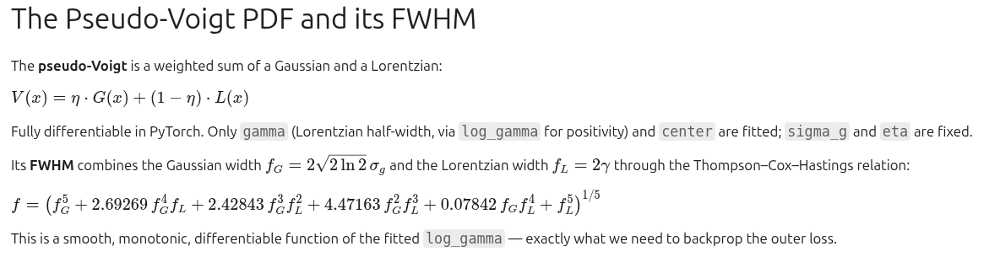
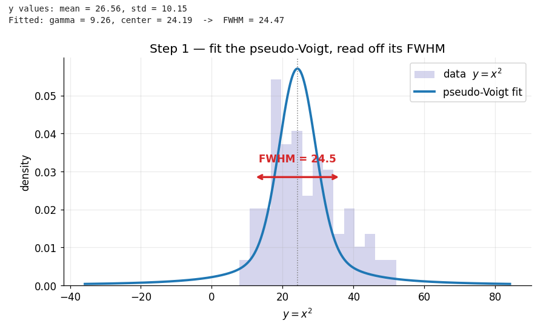
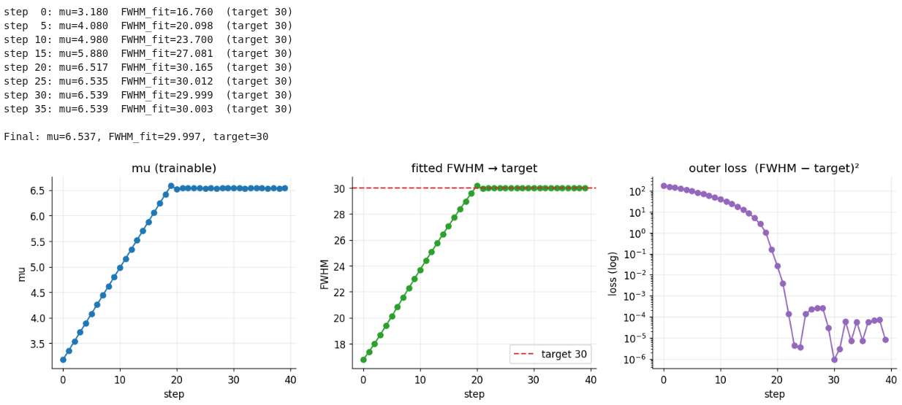
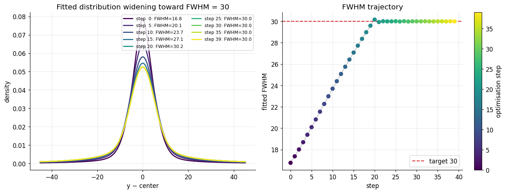

# EDA

Once I had the data, I began analyzing it. I built a single DataFrame with all experiments: 2 lasers (1 nW and 3 nW), each measured across transmissions of [5, 10, 20, 40, 60, 80, 100].

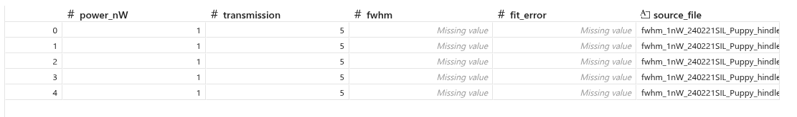

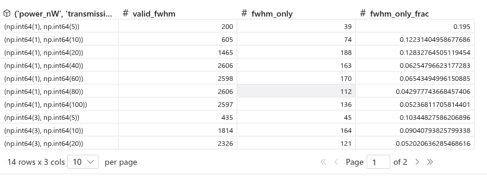

## Amount of runs per PLE (with failed fwhm)
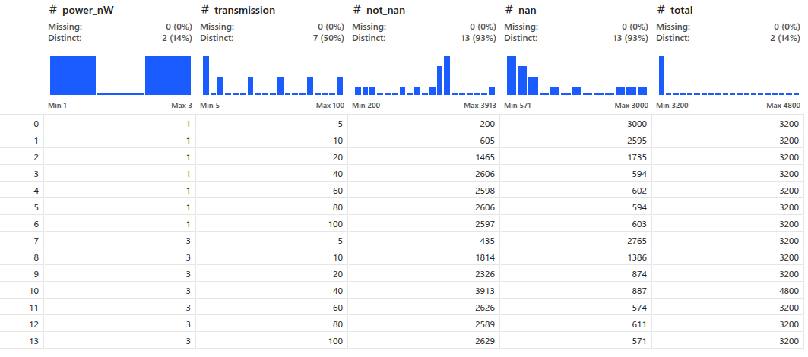

## Success rate vs. transmission

Higher transmission yields fewer NaN values (failed fits) in both cases.

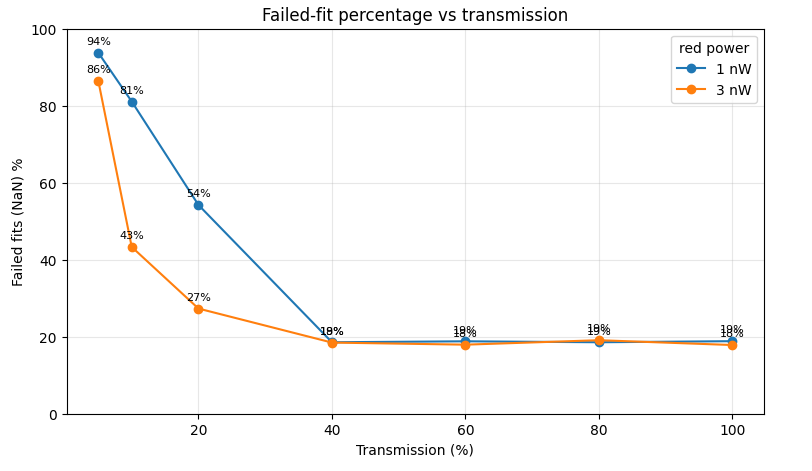

## FWHM distribution per experiment
### Using log scale
The FWHM values are widely spread, so log scaling is appropriate.
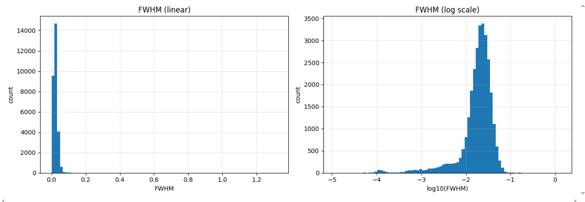


### Distributions
At higher transmission the FWHM distribution is clean and well defined; at lower transmission it becomes much noisier.
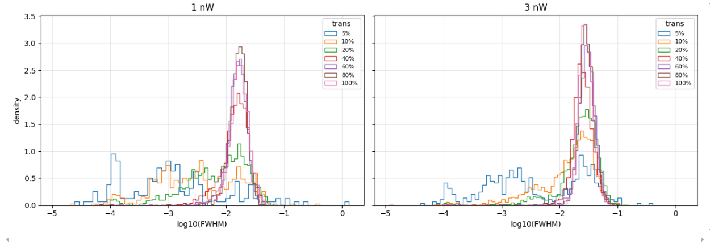
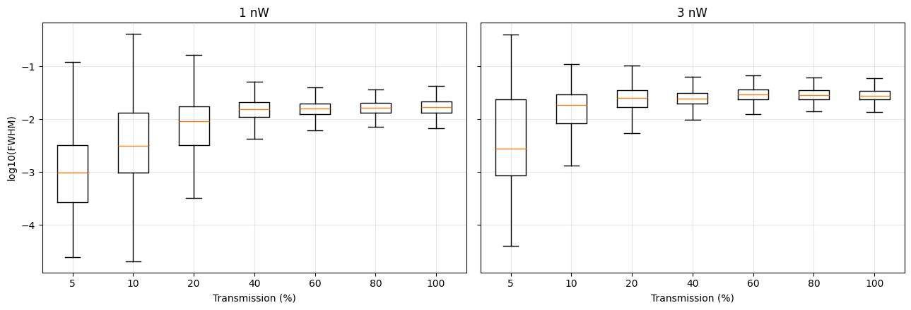

### FWHM vs. fit error
The smaller the FWHM, the higher the fit error — this is especially pronounced for the extremely small values.
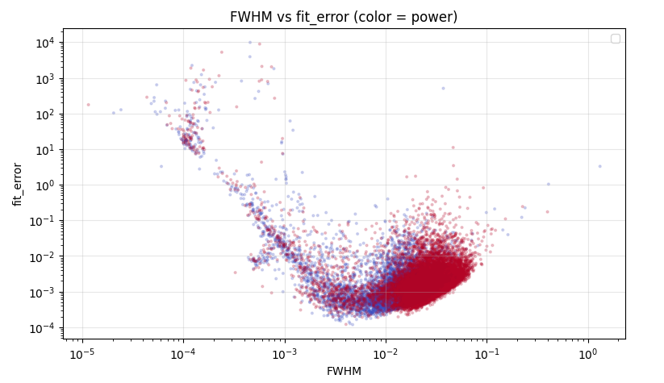

### Good news!
Key finding: the FWHM are continuous values, not binned as we had assumed. This simplifies the final loss.

# Real Data Loss
## MMD²

I found a loss function that compares two lists of samples and tested whether it optimizes on real data, using `(df["transmission"] == 60) & (df["power_nW"] == 3)`.

MMD² (Maximum Mean Discrepancy) measures how different two sets of samples are, without needing to know their underlying distributions. It maps the samples into a feature space via a kernel (here a Gaussian/RBF kernel) and compares their mean embeddings:

MMD²(X, Y) = mean(k(x, x')) + mean(k(y, y')) − 2·mean(k(x, y))

It is 0 when the two sample sets come from the same distribution and grows as they diverge. Because it is built from a smooth kernel, it is differentiable — which is exactly what we need to backpropagate through and optimize.

### Development plot for test

We can follow the optimization step by step.
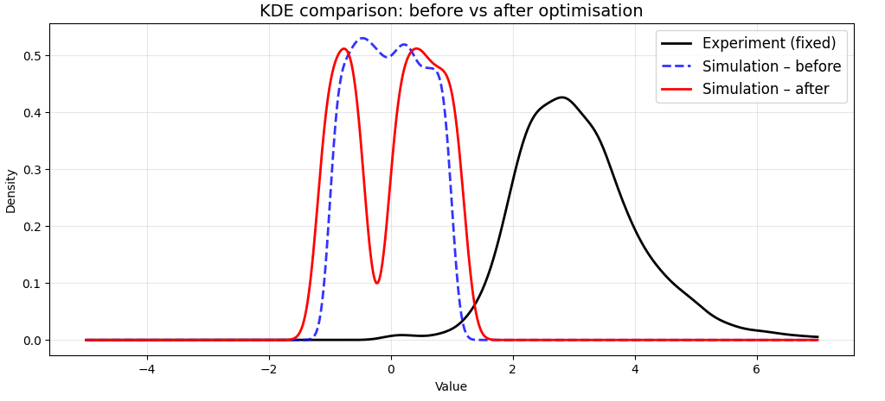
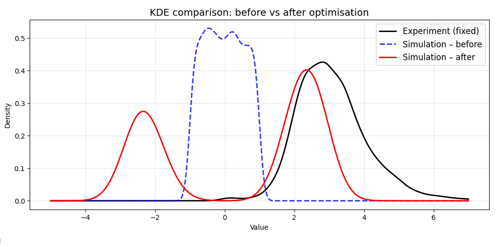


### Sigma tuning

The choice of sigma in the loss affects the result. This warrants further experimentation.


### Conclusion
It works: dLoss/dFWHM is computed. The next step is dFWHM/dfrequencies.


## Waserstein 1D loss

Realizing that the pot does not converge entirely, even when we were simply optimizing the sample plot made me think of looking for a new loss function. As I realized that we have the same amount of samples as target data (to be double checked with Gregor). We can simply used the Waserstein for 1D which is much simpler, quicker and doesnt have the issue of vanishing gradients as MMD^2 does. 


Unlike MMD², the 1D Wasserstein distance requires no kernel bandwidth tuning.
It directly measures the L1 distance between the sorted samples of two distributions:

$$W_1(P, Q) = \frac{1}{N} \sum_{i=1}^N |P_{(i)} - Q_{(i)}|$$

where $P_{(i)}$ and $Q_{(i)}$ are the sorted samples.
This gives a natural, parameter-free way to match distributions in 1D.

### Optimization development

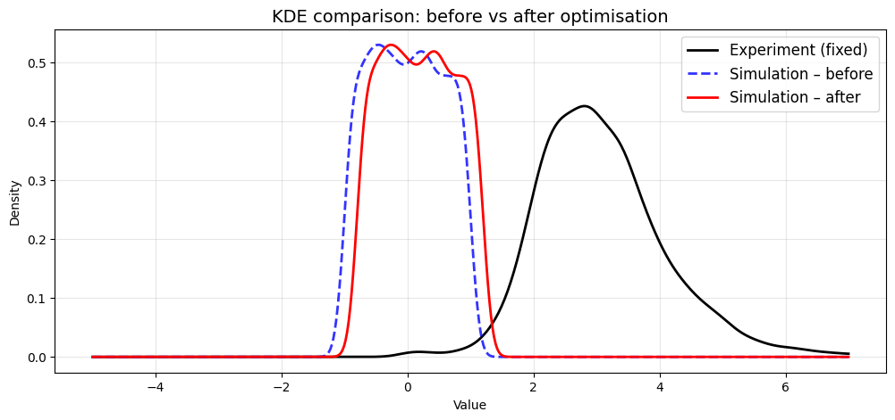
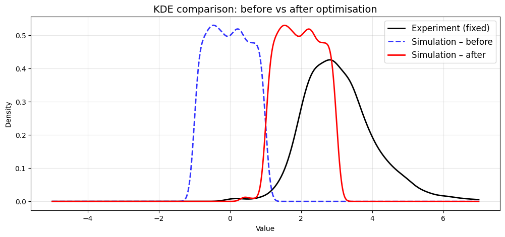
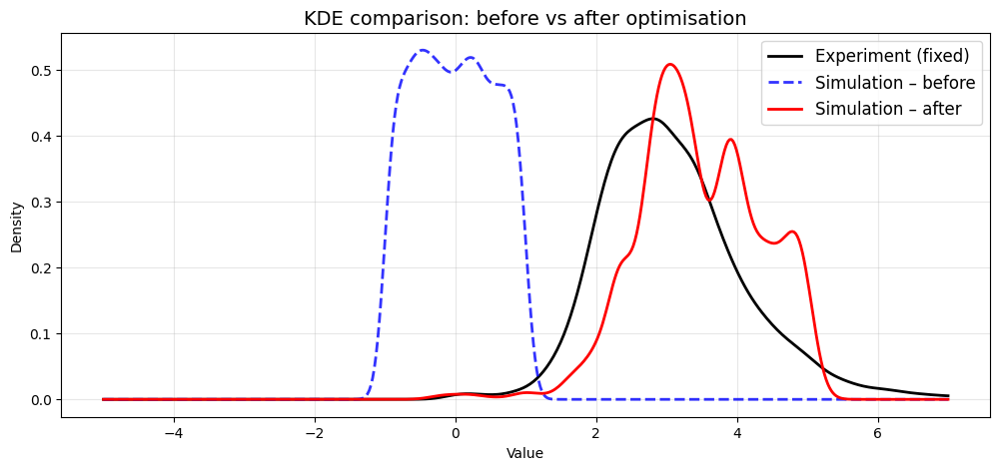
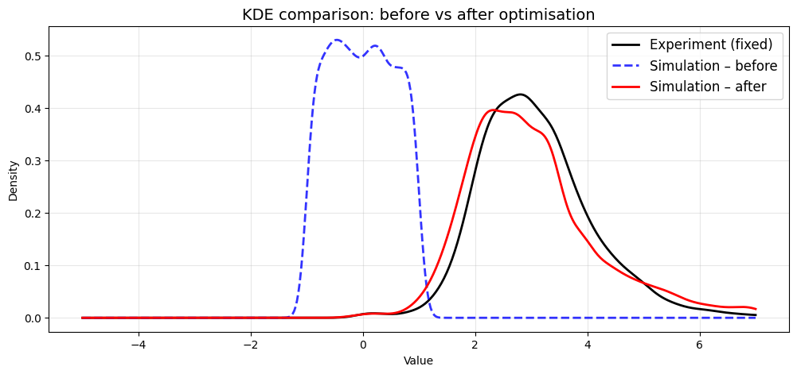
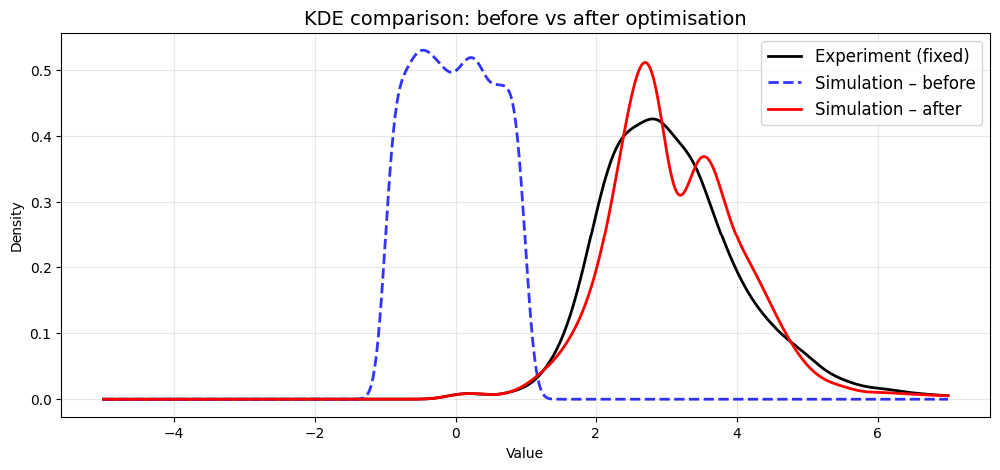
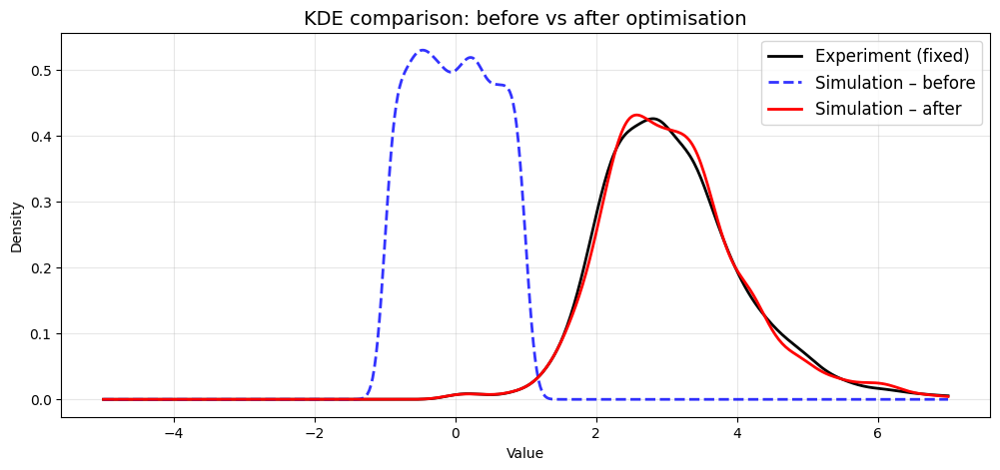

# Gamma differentiable

We test it by creating a true gamma distribution and building the MMD² loss from it.

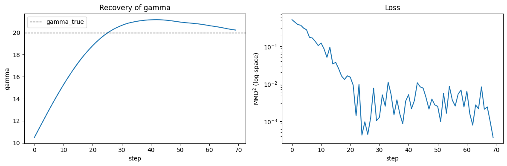

# Next steps

- Integrate dloss/dn
- Research reinforce approach, if not suitable do n+1 / n-1 approach and update lambda as average of gradients from both runs (other strategies to be found)
