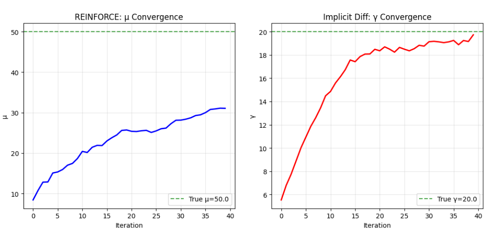
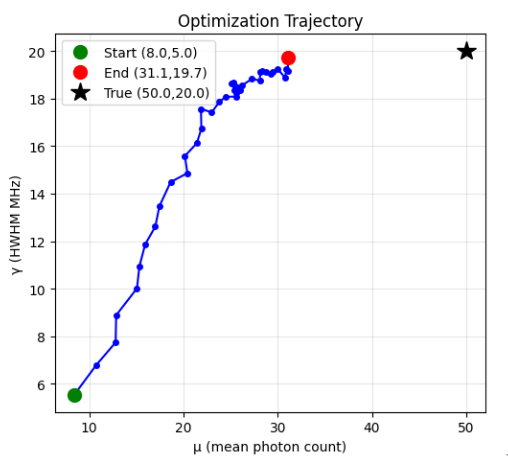
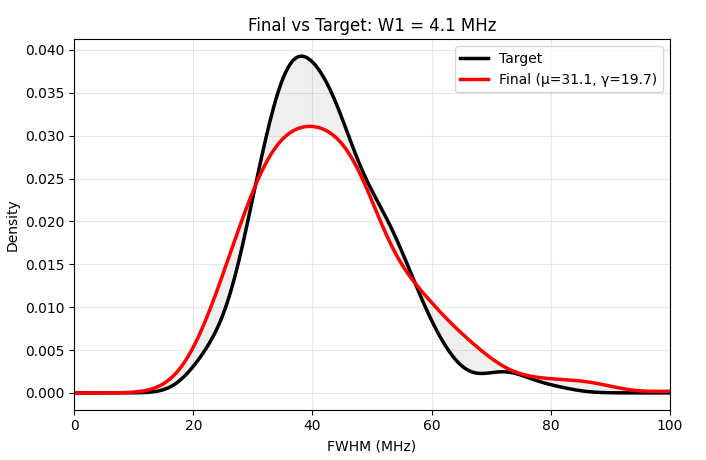
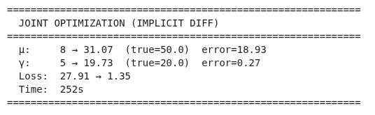
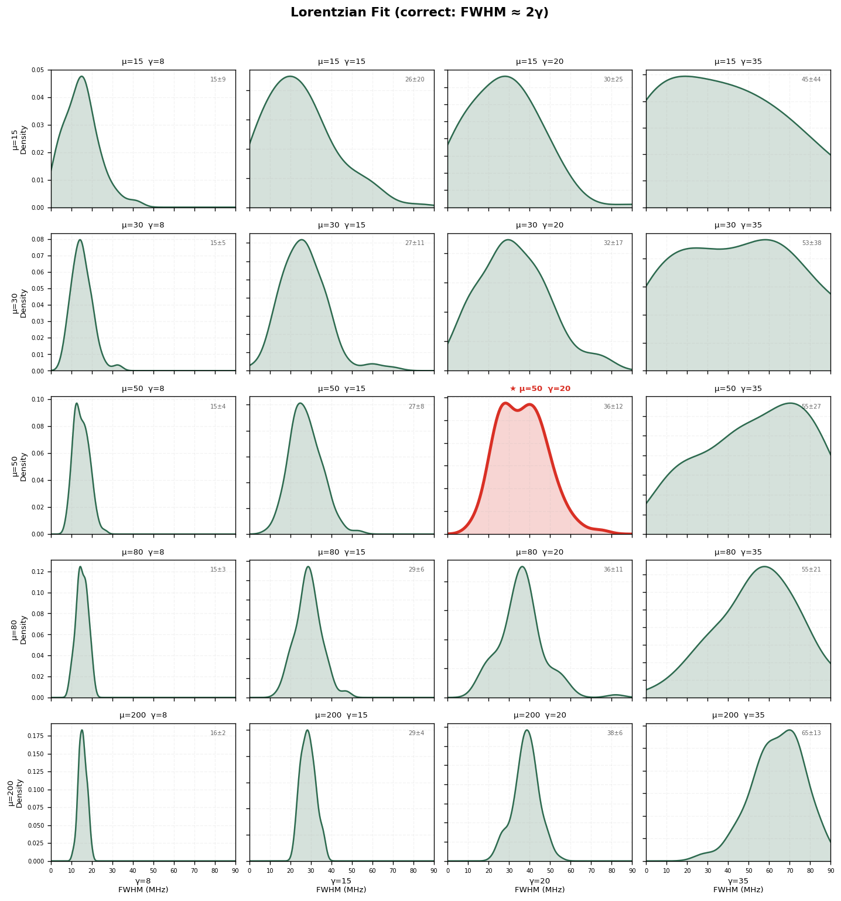

# Optimization of μ

**From discrete differentiation to REINFORCE**

 

Progress update — 17 July 2026

---

## Original idea: discrete differentiation

- Requires two separate runs → expensive
- Doesn't scale with more parameters
- γ gradient had to be averaged, never calculated inside the N-sample simulation

---

## New idea: REINFORCE

- From reinforcement learning: get gradients through non-differentiable sampling
- REINFORCE estimates gradient of expected reward:
  $$\nabla_\mu \mathbb{E}[R] = \mathbb{E}[\;R \cdot \nabla_\mu \log p(\text{data} \mid \mu)\;]$$
- With baseline to reduce variance:
  $$\nabla_\mu \approx \frac{1}{N}\sum_i (R_i - \bar{R}) \cdot \nabla_\mu \log p(x_i \mid \mu)$$
- Positive reward → increase likelihood; negative → decrease
- Lets us backprop through the full simulation, including fitting

---

## Experiment 1: Many samples – One loss

- Many runs, but only a single global loss
- Every sample gets the same advantage → no differential signal
- **Result:** no optimization

---

## Experiment 2: Many samples – Many losses

- Each run gets its own loss (Wasserstein distance)
- Per-run advantage → gradient averaged across runs
- Works well, but Wasserstein re-ordering causes jumps near optimum

---

---

## Joint Optimization: μ and γ

- Optimizing both is **degenerate**: different (μ, γ) pairs produce the same FWHM
- The true parameters cannot be identified from FWHM alone

---

---

---

---

## FWHM Distributions: μ vs γ Effects

- **Higher μ** → more photons → narrower FWHM (thinner distribution)
- **Larger γ** → wider line → thicker distribution (plus shift)
- The two effects can cancel → many (μ, γ) pairs give identical FWHM

---

## Solution: Match the Uncertainty σ

**Key insight:** different (μ, γ) pairs produce different FWHM *uncertainties* (σ)

| Scenario | μ | γ | Photons | σ (uncertainty) |
|---|---|---|---|---|
| Few photons, narrow line | 20 | 10 | Few | **High** |
| Many photons, narrow line | 200 | 5 | Many | **Low** |

Both match the same FWHM — but σ tells them apart.

---

## Joint Optimization with σ

$$L = L_{\mathrm{FWHM}} + \lambda \cdot L_\sigma$$

**Gradients:**
- **μ:** REINFORCE with combined reward (FWHM + σ matching)
- **γ:** implicit diff for FWHM + CRLB approximation for σ ($d\sigma/d\gamma \approx 2/\sqrt{n}$)

**Result:** degeneracy broken — μ and γ converge closer to true values.

**How σ is used:**
- σ comes from the Hessian of the log-likelihood at the fit optimum
- Both FWHM and σ matched via quantile-aligned absolute error
- μ controls σ mainly through photon count; γ controls FWHM through linewidth
- The two terms anchor different aspects → breaks the degeneracy

---

## Summary

| Step | What | Status |
|------|------|--------|
| 1 | γ optimization via implicit diff | ✅ Works |
| 2 | μ optimization via REINFORCE | ✅ Works |
| 3 | Joint μ + γ optimization | ❌ Degenerate |
| 4 | Joint + σ matching | ✅ Degeneracy broken |
| 5 | Real data optimization | 🔶 In progress |

---

## Next: Optimisation with real data
