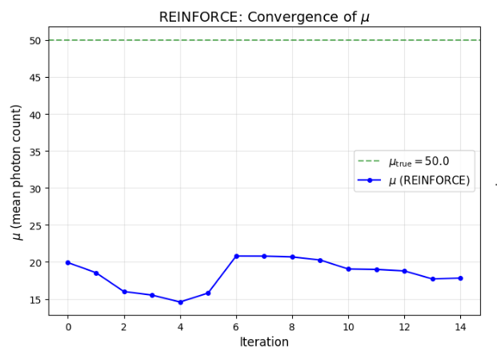
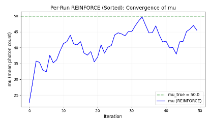
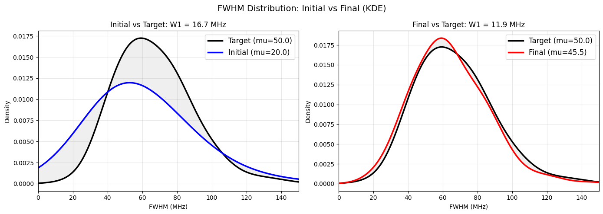

# Optimization of mu
## Original idea discreat differenciation

- explain that this has problem as 2 runs must be made(which is expensive) and it explodes with more parameters
- gamma step needed to be averaged and never calculated in N itself

## New idea Reinforce
- Taken from reinfocement learning
- Brief explanation of reinforce

# First Reinforce Experiment: Many samples - One loss
- We dont have only one sample to calulate loss, we have many.
- Idea use the many samples (of each run) and calculate the step using the advantage from the loss
- Result: bad, no optimization.

- Makes complete sense, as all advantages are the same, as we have many samples no clear direction for improvement

# Second Reinforce Experiment: Many samples - Many losses

- New idea. Each run has its own loss (the distance of their own point for the wasserstein 1d). Each run gets its own loss/advantage and the optimization of mu is average through all the gradients calculated per run. (right?)

This optimizes but when it gets close to the real it is not as good, as wasserstein jump form one place to another (future idea, fix the order from the beginning and dont let the f)
