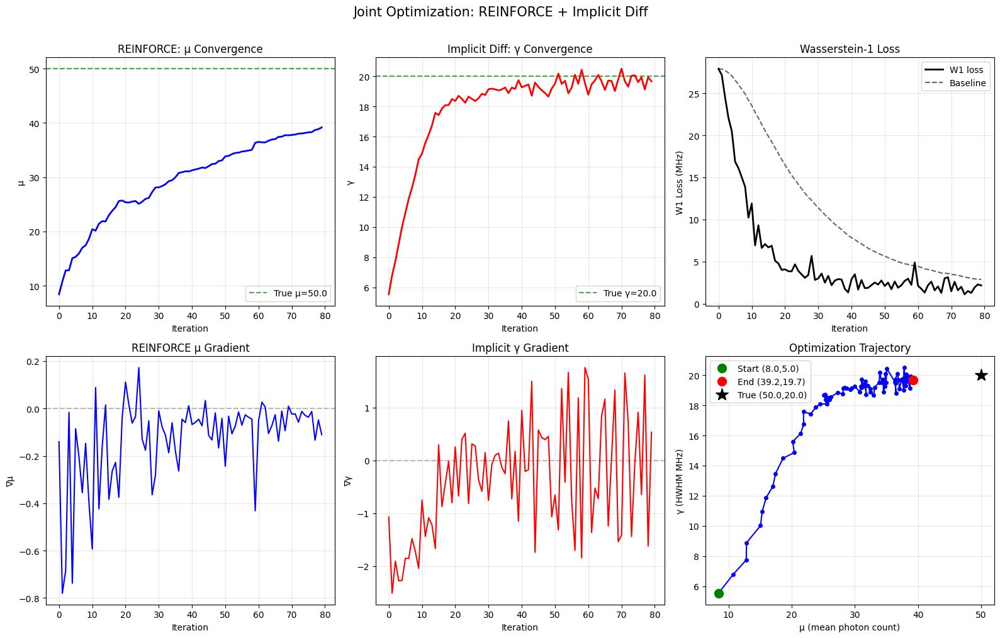
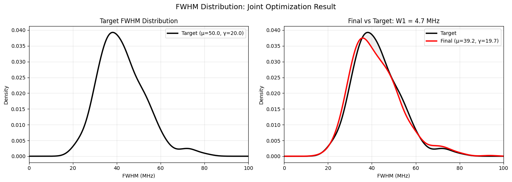
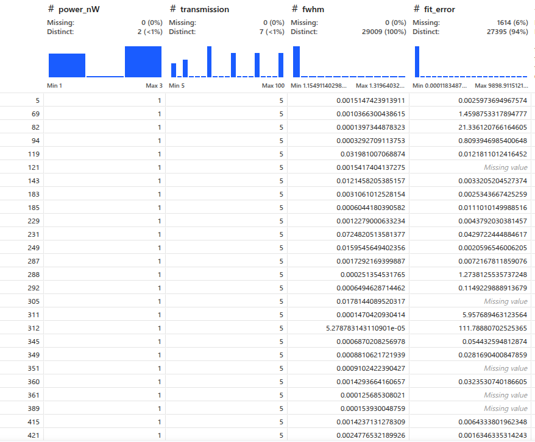
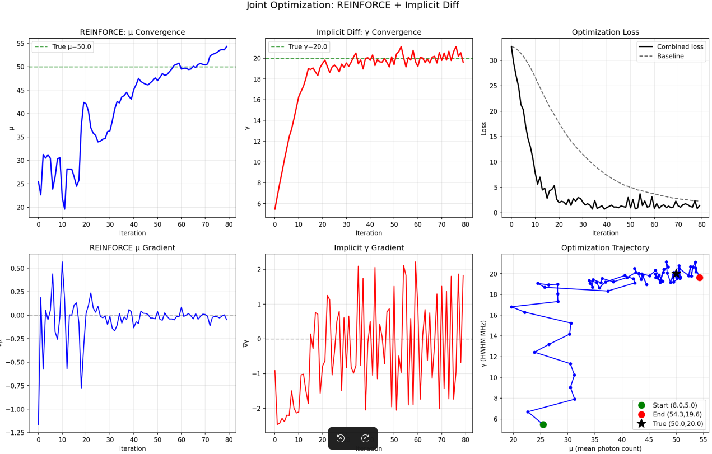
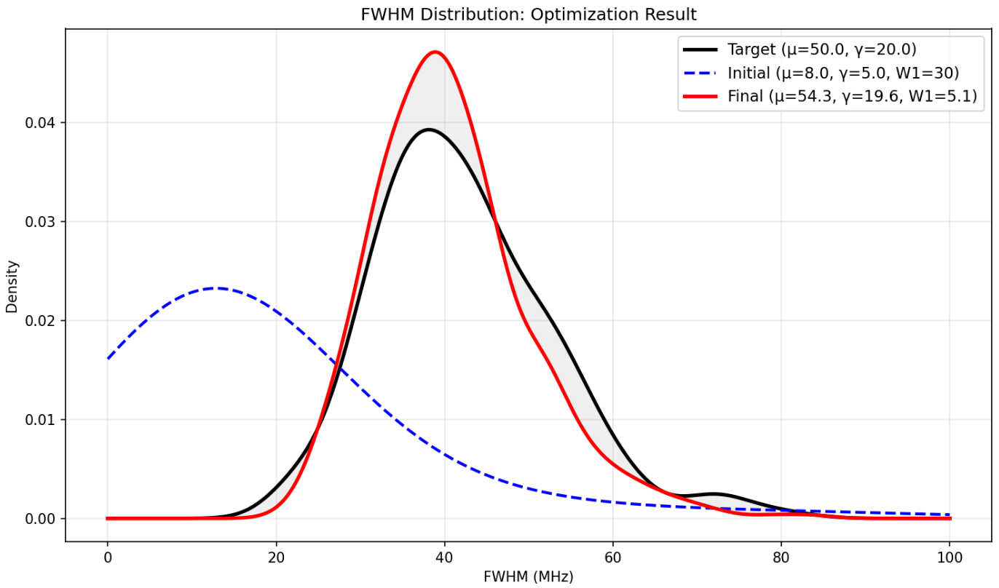
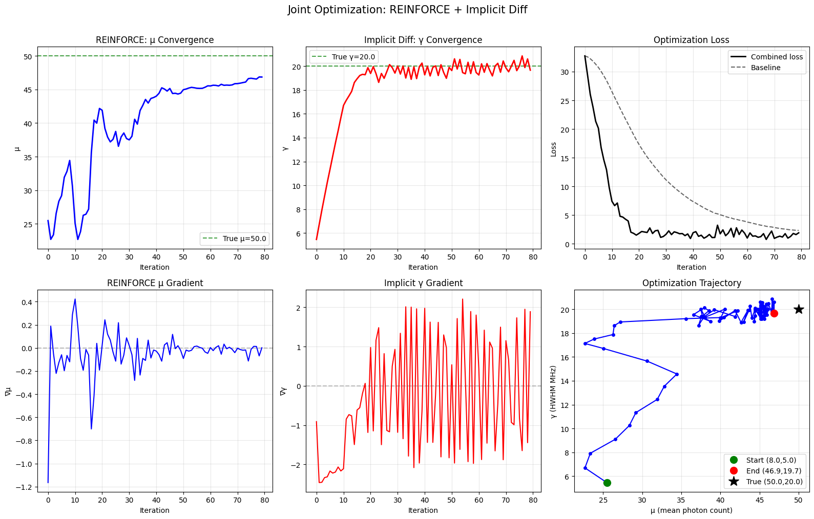
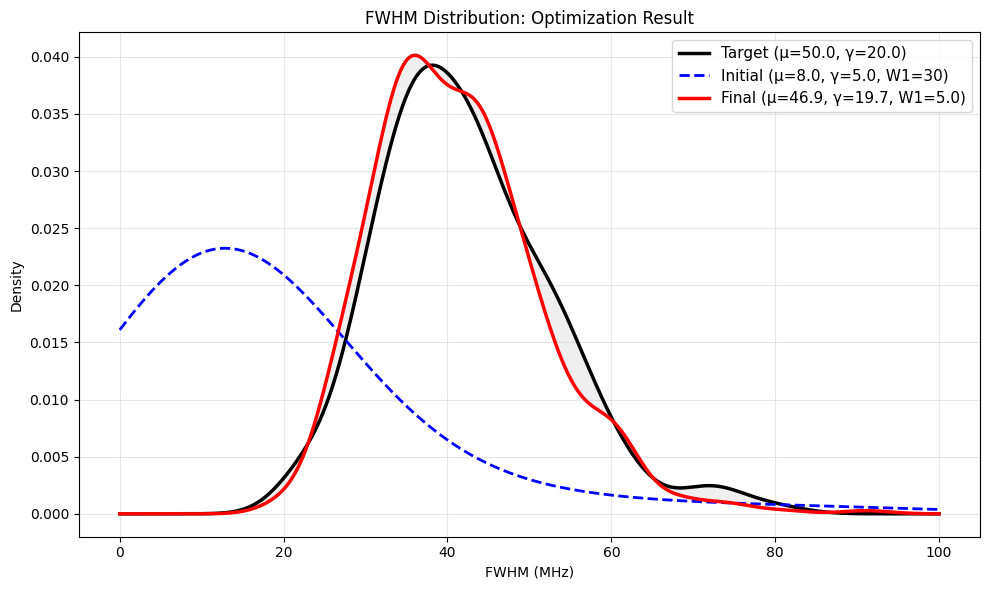
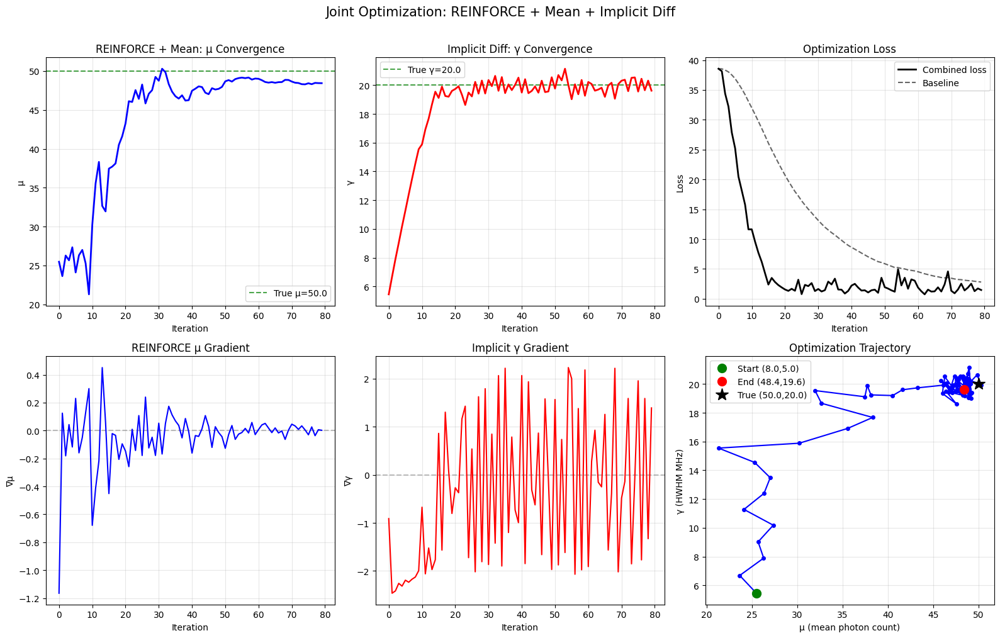
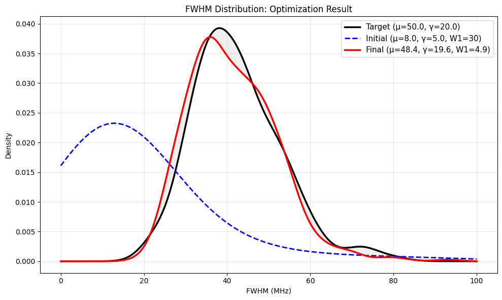

# Optimization of μ

## Original Idea: Discrete Differentiation
- Requires two separate runs → expensive and does not scale with more parameters
- γ gradient was obtained by averaging over shifted-parameter runs, never inside the N-sample simulation itself

## New Idea: REINFORCE
- From reinforcement learning: a way to obtain gradients through stochastic computations
- We want to optimize μ, but the loss involves non-differentiable sampling
- REINFORCE estimates the gradient of the expected reward:

  $$\nabla_\mu \approx \frac{1}{N}\sum_{i=1}^{N} \text{Loss}_i \cdot \frac{n_i - \mu}{\sigma^2}$$

- Baseline (average loss) reduces variance:

  $$\nabla_\mu \approx \frac{1}{N}\sum_{i=1}^{N} (\text{Loss}_i - \bar{L}) \cdot \frac{n_i - \mu}{\sigma^2}$$

- The score $(n_i - \mu) / \sigma^2$ tells how μ influenced each outcome
- This lets us backpropagate through the whole simulation, including the fitting step

### Baseline
- Without a baseline, even bad runs look "good" relative to nothing
- The baseline centers the signal: above = bad, below = good
- We use an exponential moving average across steps:

  $$\text{bl} = 0.9 \cdot \text{bl}_{\text{prev}} + 0.1 \cdot \bar{L}_{\text{step}}$$

- Each run's advantage = reward − baseline (same baseline for all runs in a step)
- Recent steps matter more than old ones (adapts as μ improves)

---

# REINFORCE Experiments

## Experiment 1: Many Samples – One Loss
- Many samples per run, but only a single global loss
- Every sample in a run gets the same advantage → no differential signal to guide improvement
- Result: no optimization

## Experiment 2: Many Samples – Many Losses
- Each run gets its own loss (Wasserstein-1D distance of its own point)
- Per-run advantage → gradient averaged across runs
- Optimizes well until close to the target, where Wasserstein re-ordering causes sudden jumps
  *(Future idea: fix the event order from the start to avoid those jumps)*

---

# Joint Optimization: μ and γ

Now that gamma and mu optimization work, we combine them.

## Degeneracy Problem
- Optimizing both together is degenerate: different (μ, γ) pairs can produce the same FWHM distribution
- This makes it impossible to identify the true parameters from FWHM alone

## μ and γ Influence on FWHM Distributions
- Visual inspection to understand the degeneracy
  - Higher μ → more photons → narrower FWHM (thinner distribution)
  - Larger γ → wider line → thicker distribution (plus a shift)
  - The two effects can cancel: many (μ, γ) combinations give identical FWHM

---

# Joint Optimization with FWHM σ (Uncertainty)

**Key insight:** the data contain uncertainties.

- Different (μ, γ) pairs can match the same FWHM but differ in their FWHM uncertainty (σ)
- Example:
  - μ=20, γ=10 → few photons, large σ (uncertain FWHM)
  - μ=200, γ=5 → many photons, small σ (precise FWHM)
- Both hit the same FWHM target, but σ tells them apart

**Solution:** add a second term that matches the whole σ distribution

$$L = L_{\mathrm{FWHM}} + \lambda \cdot L_\sigma$$

**Gradients:**
- μ: REINFORCE with combined reward (FWHM + σ matching)
- γ: implicit differentiation for FWHM + CRLB approximation for σ (dσ/dγ ≈ 2/√n)

## Sigma Optimisation – How It Works
- σ comes from the Hessian of the log-likelihood at the fit optimum
- Loss: quantile-aligned absolute error on both FWHM and σ
- μ gradient: per-run advantage = −|FWHMᵢ − target| − λ·|σᵢ − target_σ|

  ∇μ = mean((advantage − baseline) · score)

- γ gradient: sign(FWHM−target)·(dFWHM/dγ) + λ·sign(σ−target)·(2/√n)
- μ controls σ mainly through photon count; γ controls FWHM through linewidth
  → the two terms anchor different aspects, breaking the degeneracy

---

# Joint Optimization Results with FWHM σ

## First Result: Basic Joint Optimization
Works well but overshoots because close to the true value the distributions match closely and the μ gradient becomes mostly noise. With a large μ it jumps around.

## Second Result: With Learning Rate Decay
We included gradient decay to restrict the noise.

Falls slightly short but still very good. (We could keep experimenting with decay strategies.)

## Third Result: With FWHM Mean Loss
Included a new FWHM mean loss to provide μ with a clear signal once it reaches the noisy region of the distribution.

**New:** Added a **mean-matching term** to help REINFORCE push μ to the correct value when per-quantile signals become noisy.

| Gradient | Source | Why |
|---|---|---|
| **μ** (REINFORCE + mean matching) | Per-quantile reward + λ_mean·|FWHM_mean − target_mean| | Mean term gives clean signal when per-quantile gradient dies |
| **γ** (implicit diff + CRLB) | dLoss/dγ = W₁'(FWHM)·dFWHM/dγ + λ·W₁'(σ)·dσ/dγ | Matching both tightens γ constraints |

### Why the mean loss helped

The REINFORCE gradient for μ is:

$$\nabla_\mu \approx \frac{1}{N}\sum_{i=1}^N (\text{Loss}_i - \text{bl}) \cdot \frac{n_i - \mu}{\sigma^2}$$

Near the optimum the FWHM distributions nearly match, so per-quantile differences become small and noise-dominated. The correlation ρ between photon count `n_i` and per-run loss `Loss_i` drops, and the gradient vanishes.

The mean term `|FWHM_mean − target_mean|` solves this by providing a **global error signal** that persists even when individual quantiles match:

- **It has lower variance** than per-quantile differences (averaged over N=200 runs)
- **It directly correlates with μ**: higher μ → more photons → narrower FWHM → lower mean
- **It keeps the gradient alive** when the W1 signal dies, by ensuring the advantage doesn't collapse to zero
- **It acts as a regularizer**: the per-run loss `Loss_i` gets a boost of `+λ_mean·|FWHM_mean − target_mean|`, which shifts ALL advantages uniformly, biasing the REINFORCE estimate toward the correct μ

Already very good, and a cleaner convergence path than LR decay alone (12b).

---

# Real Data Optimization
*(Content to be added.)*