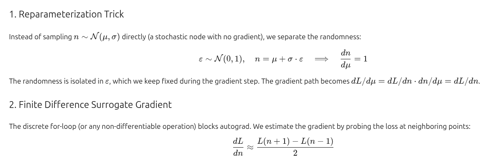
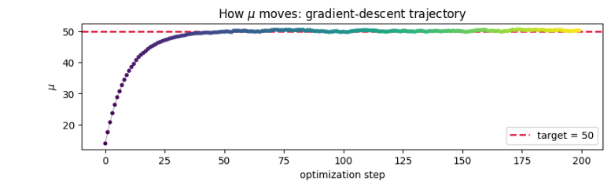
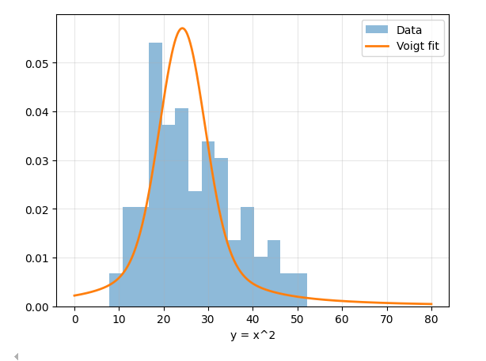
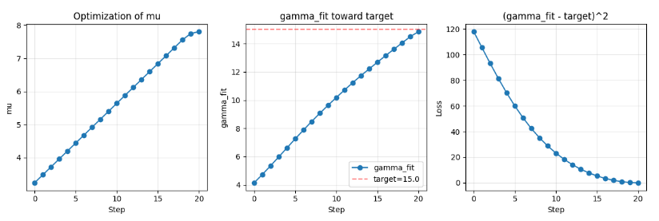
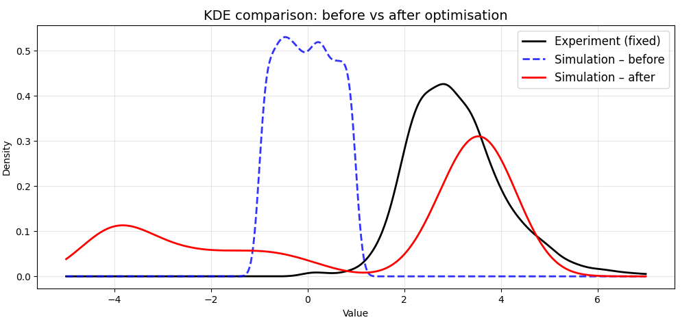
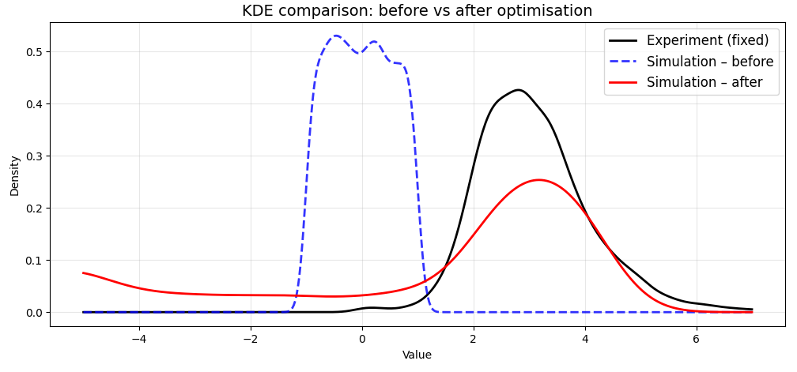
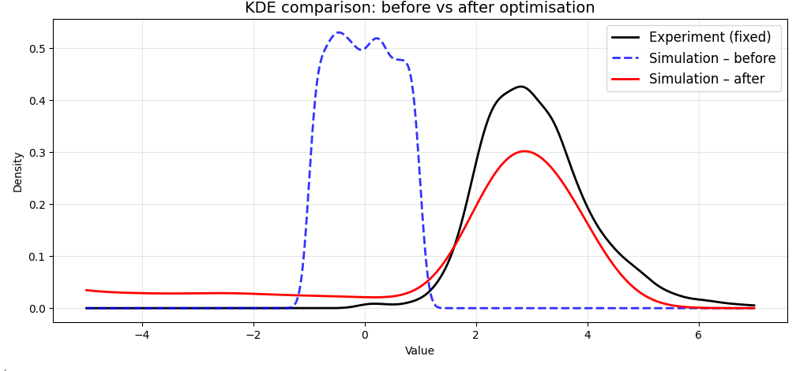
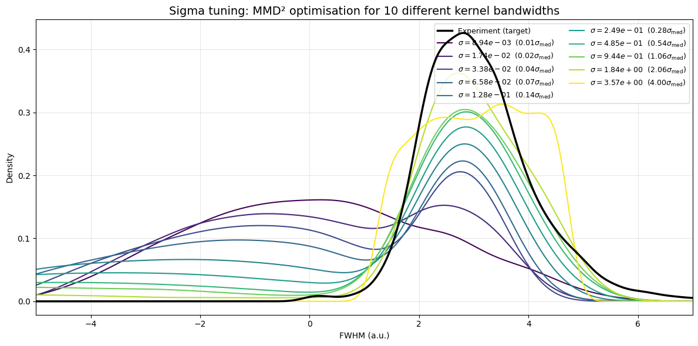

# Presentation 03 Jul 2026
This it the structure of my presentation

# Toy examples
AS we wanted to do a MC simulation that is differentiable to ncreate a program that has as an input n and gamma and gives us an output a loss function that it's optimizable for n and gamma. I first thought of doing some toy example with the optimization idea. 

## For n

I created a simple program that simulates n being sampled from a N(n,sigma) then using that sample to run a for loop and add +1 to a prediciton at each iteration and then comparing the prediction with a target (simulatio that the n only tells me the amount of runs)

## For sigma
I sample some points from a N distribution, square them and fit a pseudo voigt and get the fwmh from it and compare it to a target. From it do the back propagation.

# EDA

After I got the data I started analaying it. Created one DF with experiments there here 2 lasers 1nW and 3nW and each has transmitions going form [5,10,20,40,60,80,100]

## Success rate vs transmition

We can see that the more transmition the less nan values we get in both cases

## fwmh Distribution per experiment
### Using Log
The fwmh are spread out, it makes sense to use log scaling

### distributions
We can see that at higher transimsion we get a very clear fwmh distribution, with lower transmition it gets crazier.

### fwmh fwhm fit error
WE can clearly see that the smaller the fwmh the higher the error, partibularly by extremely small ones.

### Good news!
Great finding fwmh are continuos values and not binned as we thought. Simplifying the final loss

# MMD^2

Found a loss function for 2 list of samples. And tryied to see if they optimized with real data. used (df["transmission"] == 60) & (df["power_nW"]==3)]

(explain MMD^2)

## Development plot for test

We can see the development step by step

## Sigma Tunning

The choice of sigma for the loss affects the result. More experimentations should be done on that. 

## conclusion
It works. dLoss/dfmwh is calculated. Now we deen dfmwh/dfrquencies

# Gamma differentiable 

We tesst it creating a true gamma distribution crating the mmd^2 loss from it.

